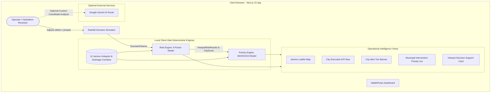

# NallahPulse — System Architecture Documentation

**Product:** NallahPulse — Jammu Urban Waterlogging Intelligence  
**Document Version:** 1.0 (MVP Submission Baseline)  
**Target:** Hack for a Social Cause (HSC) 2027 / Viksit Bharat Young Leaders Dialogue (VBYLD) 2027  

---

## 1. Executive Summary & Overview

**NallahPulse** is an operational decision-support prototype engineered for the city of Jammu, Jammu & Kashmir. It demonstrates how localized urban terrain indicators, natural nallah (drainage channel) characteristics, and dynamic rainfall scenario parameters can be combined into an explainable, deterministic mathematical model to:

1. Assess simulated waterlogging risk at localized urban hotspot nodes.
2. Formulate city-wide alert levels.
3. Compute an actionable Municipal Intervention Priority triage ranking.
4. Provide structured decision support cards and suggested prototype intervention actions.

---

## 2. Component Architecture

### 2.1 Frontend & Application Framework
* **Framework:** Next.js 15.4.5 (App Router with Turbopack).
* **Language:** TypeScript 5 with strict typing.
* **Styling & Design System:** Tailwind CSS with Lucide React iconography, custom color-coded risk and alert badges, and responsive glassmorphism containers.
* **State Management:** React hooks (`useState`, `useEffect`, `useMemo`, `useCallback`) for sub-millisecond, synchronous recalculations upon slider input without network latency or page reloads.

### 2.2 Geographic Map Layer (`components/ClientMap.tsx`)
* **Library:** Leaflet 1.9.4 and `react-leaflet` 4.2.1.
* **Map Center:** Jammu, J&K coordinates `[32.7266, 74.8570]`, default zoom level 12.
* **Hotspot Markers:** Custom dynamic HTML markers displaying color-coded risk rings and priority tags.
* **Illustrative Drainage Corridors:** Toggleable dashed polyline layer mapping natural stormwater conduits (e.g., Landoi Choi Nallah, Muthi Feeder, Nai Basti Outfall).
* **Interactivity:** Map click events, marker selection synchronization with sidebar cards, and smooth programmatic fly-to navigation (`map.flyTo`).

### 2.3 Prototype Hotspot Data Layer (`lib/data/jammuHotspots.ts`)
Contains 10 curated prototype urban nodes across Jammu Municipal Corporation (JMC) wards:
1. **Krishna Nagar (Science College Canal Road area)** — Low-elevation basin, high blockage tendency.
2. **Muthi (Near Muthi Nallah / Canal area)** — Narrow conduit bottleneck, high drainage vulnerability.
3. **Jewel Chowk (Major commercial junction)** — Dense urban intersection, critical traffic transit proxy.
4. **Dogra Chowk (Tawi bridge approach)** — Roadway depression, moderate drainage.
5. **Nai Basti (R.S. Pura Road drain convergence)** — Natural drainage confluence point.
6. **Talab Tillo (Main road market stretch)** — Severe silt accumulation history.
7. **Bikram Chowk (University road transit junction)** — High population & transit impact.
8. **Preet Nagar (Industrial / residential basin)** — Low infiltration, high historical risk.
9. **Janipur (High Court Road)** — Hillside runoff convergence.
10. **Bantalab (Elevated suburban zone)** — High elevation baseline node with naturally low vulnerability.

Each hotspot defines standard numeric proxies (0–100 scale):
* `drainageVulnerability`
* `historicalRisk`
* `rainfallFactor`
* `terrainVulnerability`
* `blockageFactor`
* `populationImpactProxy`
* `elevationMeters`

---

## 3. Mathematical Models

### 3.1 Waterlogging Risk Engine (`lib/riskEngine.ts`)

The risk engine computes a continuous composite score (0–100) per hotspot:

$$\text{Risk Score} = \text{clamp}_{0}^{100}\Big(\text{Rainfall} + \text{Drainage} + \text{Historical} + \text{Blockage} + \text{Terrain} + \text{Antecedent}\Big)$$

#### Detailed Components:
1. **Rainfall Contribution (Max ~28 pts):**
   $$\text{Base} = \min\left(100, \frac{\text{Intensity (mm/h)}}{80} \times 100\right)$$
   $$\text{Duration Multiplier} = \begin{cases} 1.0 & \text{if Flash Storm} \\ \min(1.4, 1 + (\text{Duration} - 1) \times 0.15) & \text{otherwise} \end{cases}$$
   $$\text{Rainfall Contribution} = \min(100, \text{Base} \times \text{Duration Multiplier}) \times \left(\frac{\text{RainfallFactor}}{100}\right) \times 0.28$$

2. **Drainage Vulnerability Contribution (Max ~30 pts):**
   $$\text{Effective Drainage} = \text{DrainageVulnerability} \times \frac{1}{\text{SeasonCapacityFactor}}$$
   $$\text{Drainage Contribution} = \min(100, \text{Effective Drainage}) \times \text{BlockageMultiplier} \times 0.30$$
   *(Season Factors: Peak-Monsoon = 0.65, Pre-Monsoon = 0.85, Post-Monsoon = 0.90, Winter = 1.00)*  
   *(Blockage Multipliers: Normal = 1.00, Partially Cleared = 1.25, Blocked = 1.60)*

3. **Historical Risk Contribution (Max ~20 pts):**
   $$\text{Historical Contribution} = \text{HistoricalRisk} \times 0.20$$

4. **Blockage Factor Contribution (Max ~12 pts):**
   $$\text{Blockage Contribution} = \text{BlockageFactor} \times \text{BlockageMultiplier} \times 0.12$$

5. **Terrain Vulnerability Contribution (Max ~6 pts):**
   $$\text{Terrain Contribution} = \text{TerrainVulnerability} \times 0.06$$

6. **Antecedent Moisture Contribution (Max ~12 pts):**
   $$\text{Effective Moisture} = \min\left(100, \text{AntecedentMoisture} + \text{SeasonAntecedentBoost}\right)$$
   $$\text{Antecedent Contribution} = \left(\frac{\text{Effective Moisture}}{100}\right) \times 12$$
   *(Season Boosts: Peak-Monsoon = +20, Post-Monsoon = +10, Pre-Monsoon = +5, Winter = +0)*

#### Risk Classification Thresholds:
* **CRITICAL:** Score $\ge 78$
* **HIGH:** Score $60 \le s < 78$
* **MODERATE:** Score $38 \le s < 60$
* **LOW:** Score $< 38$

---

### 3.2 City Alert Tier Aggregation

The city-wide alert tier dynamically aggregates all 10 monitored hotspot alert statuses:
* **RED ALERT:** $\ge 2$ hotspots in CRITICAL ($s \ge 78$).
* **ORANGE ALERT:** $\ge 1$ hotspot in CRITICAL OR $\ge 3$ in HIGH ($s \ge 60$).
* **YELLOW ALERT:** $\ge 1$ hotspot in HIGH OR $\ge 3$ in MODERATE ($s \ge 38$).
* **GREEN ALERT:** Default baseline condition.

---

### 3.3 Municipal Intervention Priority Engine (`lib/priorityEngine.ts`)

To support municipal decision-makers with actionable operational triage, the Priority Engine weights live physical risk against urban exposure:

$$\text{Priority Score} = \text{clamp}_{0}^{100}\Big(\text{Risk} \times 0.60 + \text{PopulationProxy} \times 0.20 + \text{BlockageFactor} \times 0.10 + \text{DrainageVuln} \times 0.10\Big)$$

#### Priority Tiers:
* **IMMEDIATE:** Score $\ge 80$ (Urgent high-capacity pump deployment & blockage clearing)
* **HIGH PRIORITY:** Score $60 \le s < 80$ (Standby pump staging, culvert intake inspection)
* **MONITOR / PREPARE:** Score $40 \le s < 60$ (Conduit water level monitoring, floating debris clearance)
* **LOW PRIORITY:** Score $< 40$ (Scheduled ward routine monitoring)

#### Deterministic Sorting:
Rankings are sorted strictly by:
1. `priorityScore` (Descending)
2. `riskScore` (Descending tie-breaker)
3. `blockageFactor` (Descending tie-breaker)
4. `hotspotName` (Alphabetical tie-breaker)

---

## 4. Optional AI Integration (`lib/gemini.ts`)

* **Scope:** Provides supplementary narrative explanations for arbitrary custom coordinate clicks and user-uploaded terrain imagery.
* **Separation:** Completely decoupled from the core mathematical scenario simulator.
* **Fault-Tolerance:** Built-in deterministic fallback data when `GEMINI_API_KEY` is not present, guaranteeing 100% offline demonstration readiness.

---

## 5. Prototype Limitations & Boundaries

1. **Synthetic Demonstration Data:** Hotspot factor proxies (0–100) are calibrated for prototype demonstrations and do not represent official JMC GIS measurements.
2. **Simplified Hydrology:** Uses a deterministic lumped-parameter index model rather than full 2D hydrodynamic Saint-Venant hydraulic simulations.
3. **Illustrative Corridors:** Drainage lines are representative conceptual traces, not engineered CAD/GIS municipal drawings.
4. **No Real-Time Dispatch:** Outputs are formatted as *"Suggested Prototype Actions"* to guide decision-support research without issuing actual governmental commands.
